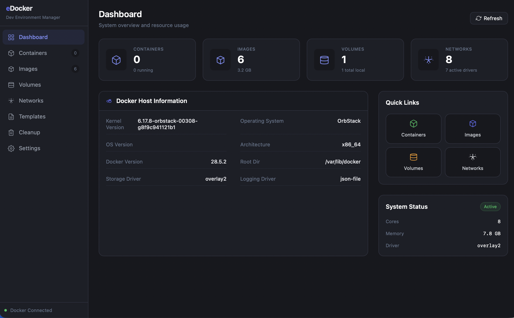
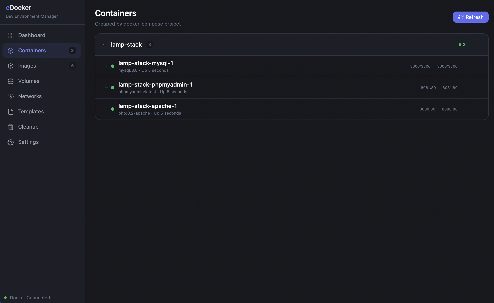
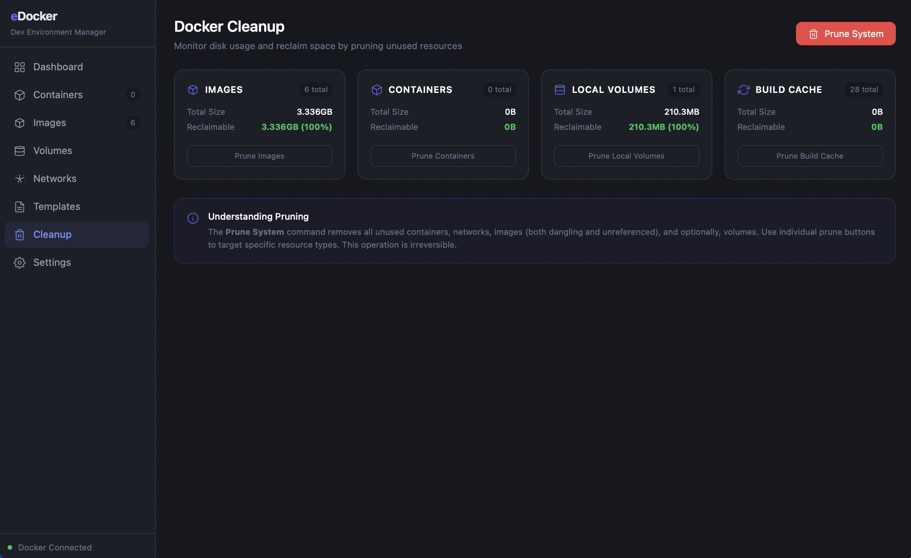
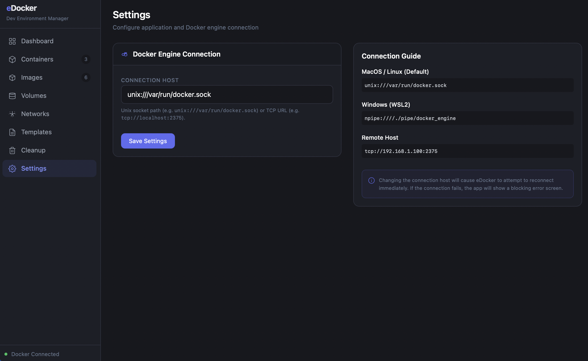

# Introduction to eDocker 🐳

Welcome to **eDocker**, the modern, open-source desktop GUI designed to make Docker management effortless, beautiful, and blazingly fast.

## Why eDocker?

Traditional Docker management can often feel fragmented between CLI and heavy desktop applications. eDocker bridges this gap by leveraging the power of **Rust (Tauri)** and **Vue 3**, providing a native experience with minimal resource overhead.

---

## Key Features

### 🚀 Intuitive Dashboard
Get an immediate overview of your system's health. Monitor resources and see exactly what's running at a glance.

### 📦 Deep Container Management
Beyond just starting and stopping. Access interactive terminals, stream real-time logs, and inspect detailed metadata with a single click.

### 🧹 Smart Cleanup
Keep your development environment lean. Our dedicated cleanup tool identifies dangling images, unused volumes, and stopped containers that are eating up your disk space.

### ⚙️ Seamless Configuration
Tailor eDocker to your workflow. Dark mode by default, responsive design, and easy-to-use settings.

---

## Technology Stack

- **Core Engine:** Rust (Tauri)
- **Frontend UI:** Vue 3, Vite, Tailwind CSS
- **Interactions:** Xterm.js for Terminal, Framer Motion (like) transitions.
- **Backend Communication:** Bollard (Docker API client for Rust).

---

## Join the Journey

eDocker is built by developers, for developers. Whether you are a DevOps professional or just starting with containers, eDocker is here to simplify your life.

[Back to Main README](../README.md)
